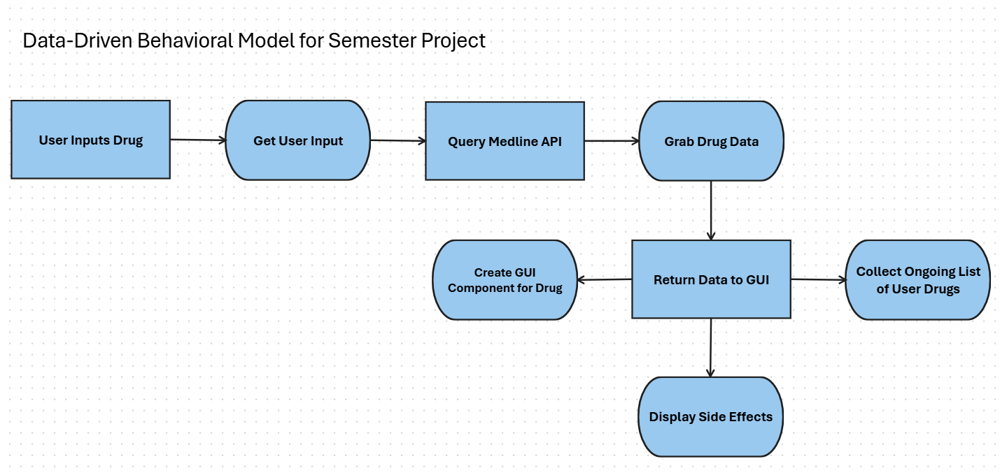
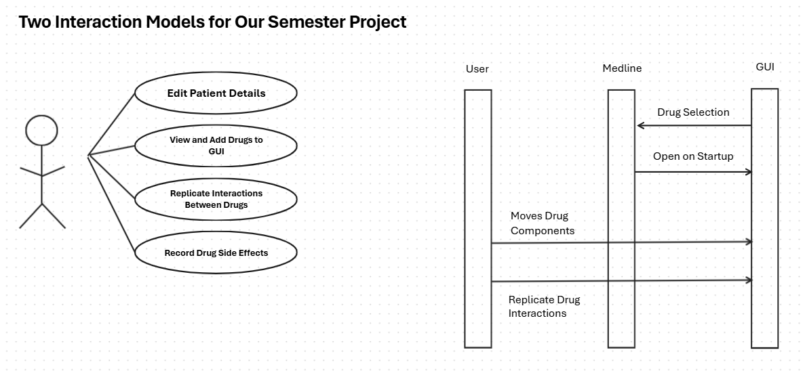
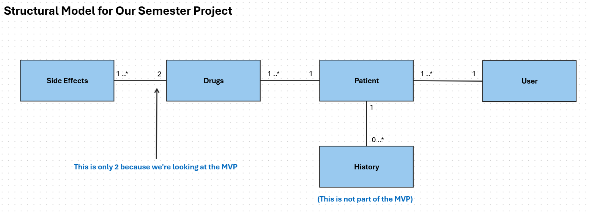

# Drug-Interaction-GUI

This drug interaction GUI built with Python and PySide6 intends to assist students who
are learning about how drugs interact and their side effects. 

### DISCLAIMER: DO NOT USE THIS AS A PROFESSIONAL MEDICAL TOOL
This project is intended for educational and research purposes only. It is not designed
for use in professional environments and should not be considered a substitute for
professional medical advice. Users are solely responsible for their use of this software
and any consequences that may arise. There may also exist side effects and
interactions outside the outputs produced by this project.

## Getting Started
### Requirements
- Python 3.6+
- Internet Connection
- pip (package manager)

### Installing
- Clone the repository locally

  `git clone https://github.com/Velvet-Vortex/Drug-Interaction-GUI.git`

  `cd Drug-Interaction-GUI`

- Optional: Create a virtual environment using one of the following:
  - macOS / Linux

    `python3 -m venv venv`

    `source venv/bin/activate`

  - Windows

    `python -m venv venv`

    `venv\Scripts\activate`

- Execute the following to download all dependencies

  `pip install -r requirements.txt`

### Executing the Program
- Change directory to the pythonGUI folder

  `cd pythonGUI/`

- Run the drug_interaction_gui.py file
  - Windows: `python drug_interaction_gui.py`
  - macOS / Linux: `python3 drug_interaction_gui.py`

## Navigating the UI
Acknowledge the disclaimer in the startup dialog, then close the dialog.
The main canvas with three prepopulated drugs should appear. To add another drug,
click the add button in the top right hand corner.

**IMPORTANT**: If the drug is not spelled right, the results will be inaccurate.

Click and drag on the drug widgets until two overlap. Wait until the bottom panel
populates. Once it does, there will be three flashcards the user can study: the
interaction between the two drugs, the side effects of the first drug, and the side
effects of the second drug. Click on the flash cards to flip between term and 
definition.

## UML Diagrams
These are the diagrams that were used to design the project. They are not
accurate to the current project state, rather they were used to define the general
functionality and structure to build off.

## Authors]()
Avalee Cruz - [@Velvet-Vortex](http://github.com/Velvet-Vortex)

Levi Chinander - [@LochiRepo](https://github.com/LochiRepo)

## License
This project is licensed under the GNU GPL-3.0 License - see the LICENSE.md file for details

## Acknowledgements
UI code was adapted from the article "Drag & Drop Widgets with PySide6"
by Martin Fitzpatrick found at https://www.pythonguis.com/faq/pyside6-drag-drop-widgets/.

This project includes code and documentation generated with the assistance of ChatGPT (OpenAI), using GPT-5.1 on November 2025 and Claude (Anthropic, 2024).
